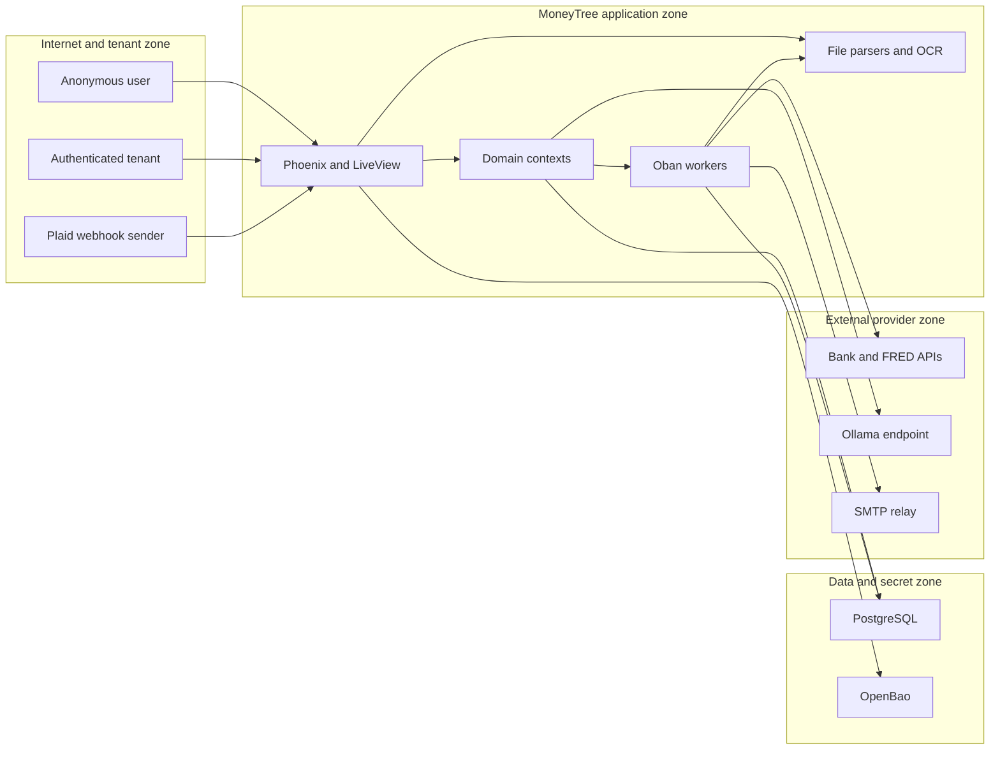

# MoneyTree security threat model

## Remediation status: completed

All ten threat-model findings below have been addressed and merged on `codex/loan-center-implementation`, alongside a full pass on the pre-existing credo and dialyzer debt this review's evidence anchors overlap with. Full suite (495 tests) passes; `mix format`, `mix compile --warnings-as-errors`, and `mix credo --strict` are clean apart from two intentionally-accepted low-priority categories noted below.

| Threat ID | Status | Fix summary | Commit |
|---|---|---|---|
| TM-001 | Fixed | Registration changeset now strips any caller-supplied `role`/`"role"` before casting and forces `:member`; a new `Accounts.register_user_with_role/2` is the only path that can set a non-default role, used by the owner-only CLI task. | `5db78ab` |
| TM-002 | Fixed | Replaced the no-op rate limiter with an ETS-backed fixed-window `MoneyTreeWeb.RateLimiter.Ets`, wired into registration, password login, magic-link, and WebAuthn endpoints. | `5db78ab` |
| TM-003 | Fixed | Added `MoneyTree.Net.SsrfGuard`, which resolves hostnames via `:inet.getaddrs/2` and rejects private/loopback/link-local/multicast ranges; wired into the Ollama provider's health check, model listing, and generation calls, with redirects disabled. | `6919851` |
| TM-004 | Fixed | SimpleFIN URL validation now goes through the same `SsrfGuard`, replacing the old lexical hostname string match with real DNS-rebinding-resistant address validation. | `1fd7ed2` |
| TM-005 | Fixed | XLSX import now pre-flights zip metadata (`:zip.list_dir/1`) and enforces entry-count, per-entry, total-uncompressed-size, and compression-ratio limits before unzipping; PDF/image OCR subprocesses now run under `MoneyTree.System.TimedCmd`, which enforces a hard timeout and SIGKILLs the OS process on expiry. | `9a78f6e` |
| TM-006 | Reviewed, no code changes required | Audited the cross-tenant object authorization surface (controllers, contexts, LiveView events) named in the report; every resource-fetch path found scopes by `current_user`/account membership. No IDOR was found; documented as reviewed rather than fixed. | — |
| TM-007 | Fixed | Plaid webhook handler now rejects requests whose signed timestamp falls outside a 300-second freshness window, in addition to the existing HMAC and nonce checks. | `da4430a` |
| TM-008 | Fixed | Split the public `/api/healthz` into a minimal liveness response; moved detailed DB-error-text and Oban queue/state/count disclosure behind a new owner-only `/api/owner/healthz` and `/api/owner/metrics`, removing the old public `/api/metrics` route. | `54a8140` |
| TM-009 | Fixed | `docker-compose.yml` now binds the dev Postgres and OpenBao ports to `127.0.0.1` instead of all interfaces, and the OpenBao dev root token is overridable via `OPENBAO_DEV_ROOT_TOKEN` instead of being a fixed, repository-known value. | `de0f060` |
| TM-010 | Fixed | Production database connections default `DATABASE_SSL` to `"true"` and verify the server certificate (`verify: :verify_peer`, `cacerts: :public_key.cacerts_get()`, SNI) unless explicitly disabled via `DATABASE_SSL_VERIFY`. | `9f5aa74` |

Alongside the threat-model work, the pre-existing credo and dialyzer debt discussed earlier in this engagement was also cleaned up:

- **Credo** (`6b88a38`, `bed33bb`, `3a14179`): fixed cond-vs-if, `Enum.filter`/`Enum.map_join` consolidation, alias ordering, `StrictModuleLayout`, redundant `with` clauses, single-clause `with`→`case` rewrites, and nested-module aliasing — roughly 85 issues across the codebase. Two categories were left as accepted debt: `Refactor.Nesting` (59 instances) and `Refactor.CyclomaticComplexity` (8 instances), both scattered thinly across 40+ files and reflecting real domain-branching logic rather than sloppy code; fixing them needs case-by-case refactoring judgment, not a mechanical pass.
- **Dialyzer** (`e1c2857`, `8d0d54c`): added missing `@type t` declarations to 38 Ecto schemas, fixed two real bugs the missing types had been masking (`Health.check_queue/1`'s Oban API mismatch, `RateProvider.settings_from_source/2`'s spec), and — after discovering `mix dialyzer` was silently crashing on every run because `:race_conditions` is no longer a valid flag on this OTP version — fixed the flag list and then fixed a third real bug it surfaced (`Loans.process_rate_import_job/1`'s spec undersold its real error space, hiding the FRED-API-key-missing error path from analysis). Remaining findings are consistent with known Ecto.Multi/Changeset opaque-type and Mix.Task false-positive classes, or harmless dead clauses guarded by invariants Ecto/Plug already enforce.

## Executive summary

MoneyTree is now a Phoenix/LiveView application rather than a Phoenix-plus-Next.js deployment, which removes a separate frontend runtime and its dependency surface. The highest current risk is nevertheless critical: anonymous callers can use the public registration API to create an `owner` account because the registration changeset accepts a caller-controlled role. That directly contradicts the clarified invite-only model. Other leading risks are the no-op authentication rate limiter, authenticated server-side request forgery through user-configurable Ollama endpoints, denial of service through archive/document processing, and authorization drift across the application's large tenant-scoped API surface. The existing opaque hashed sessions, owner pipelines, Ecto scoping patterns, encrypted provider credentials, CSP, review-before-apply flows, and webhook signatures are useful controls, but they do not close these paths. Evidence anchors: `apps/money_tree/lib/money_tree_web/router.ex` (`/api/register`, `:api_owner`), `apps/money_tree/lib/money_tree_web/controllers/auth_controller.ex` (`register/2`), `apps/money_tree/lib/money_tree/users/user.ex` (`registration_changeset/2`), and `apps/money_tree/lib/money_tree_web/rate_limiter.ex`.

## Scope and assumptions

In scope:

- Runtime code under `apps/money_tree/lib/money_tree` and `apps/money_tree/lib/money_tree_web`, including authentication, tenant authorization, imports, document extraction, background jobs, outbound integrations, and secret access.
- Shared and runtime configuration under `config/`.
- Security-relevant development/deployment tooling in `docker-compose.yml`, `scripts/setup_openbao_dev.sh`, and `docs/openbao-production-runbook.md`.
- Database schemas and migrations where they define security-sensitive storage or tenant relationships.

Out of scope:

- Active exploitation, production traffic inspection, cloud/network configuration not represented in the repository, and source-code changes.
- A dependency CVE audit, host hardening review, and detailed financial-formula correctness review.
- Generated/build directories such as `_build`, `deps`, and compiled assets.

Confirmed context:

- Production is treated as internet-facing.
- Account creation is intended to be invitation-only.
- Authenticated members, advisors, and invitees are partially untrusted tenants; authentication is not a sufficient authorization boundary.
- Financial records, uploaded loan documents, institution credentials, profile data, and session credentials are high-sensitivity assets.
- An `owner` is a privileged operator who may list users, change roles, suspend users, and inspect secret-backend status. Evidence: `apps/money_tree/lib/money_tree_web/controllers/owner/user_controller.ex` and `apps/money_tree/lib/money_tree_web/controllers/owner/secret_backend_controller.ex`.
- TLS is assumed to terminate at a reverse proxy before Phoenix. The repository config advertises HTTPS externally but starts an HTTP listener on all IPv6 interfaces in production. Evidence: `config/runtime.exs` (`MoneyTreeWeb.Endpoint` production configuration).
- Docker Compose OpenBao is treated as development-only, not an acceptable production secret service. Evidence: `docker-compose.yml` and `docs/openbao-production-runbook.md`.

Open questions that could change rankings:

- Whether the reverse proxy enforces HTTP-to-HTTPS redirects, HSTS, request-size limits, per-IP throttling, and trusted forwarded-IP handling.
- Whether PostgreSQL and OpenBao are reachable only on private authenticated networks and whether production database TLS is enabled.
- Whether any same-site subdomains can be controlled by less-trusted applications, especially if `:cookie_domain` is configured broadly.

Coverage confirmation:

- Public, authenticated, owner, LiveView, webhook, upload, queue, database, secret-provider, and outbound HTTP entry points were reviewed.
- Runtime findings are separated from development OpenBao exposure.
- Each identified trust boundary is represented below; the user-provided internet exposure, invitation model, and partial tenant trust are incorporated into prioritization.

## System model

### Primary components

- **Phoenix endpoint, router, controllers, and LiveViews:** Cowboy serves browser, LiveView, and JSON API traffic. Browser routes use sessions and CSRF protection; API routes use cookie-based authentication, with a separate owner role pipeline. Evidence: `apps/money_tree/lib/money_tree_web/endpoint.ex` and `apps/money_tree/lib/money_tree_web/router.ex`.
- **Authentication and account contexts:** `MoneyTree.Accounts` manages Argon2 passwords, opaque session tokens stored as hashes, magic links, WebAuthn challenges, invitations, roles, and account memberships. Evidence: `apps/money_tree/lib/money_tree/accounts.ex`, `apps/money_tree/lib/money_tree/sessions/session.ex`, and `apps/money_tree/lib/money_tree/accounts/account_invitation.ex`.
- **Financial domain contexts:** Accounts, transactions, mortgages, loans, evaluations, categorization, imports, and synchronization persist tenant-owned financial state through Ecto. Controllers and LiveViews generally pass `current_user` into context functions. Evidence: `apps/money_tree/lib/money_tree_web/router.ex` and context modules under `apps/money_tree/lib/money_tree/`.
- **PostgreSQL and Cloak:** Ecto persists financial and identity data. Provider credentials and selected sensitive fields use AES-GCM-backed Cloak types; session tokens and invitation tokens are stored as hashes. Evidence: `apps/money_tree/lib/money_tree/institutions/connection.ex`, `apps/money_tree/lib/money_tree/sessions/session.ex`, and `config/runtime.exs` (`MoneyTree.Vault`).
- **Oban workers:** Scheduled and request-triggered jobs synchronize institutions, import FRED rates, evaluate obligations, send mail, and extract documents. Evidence: `config/config.exs` (`MoneyTree.Oban`) and `apps/money_tree/lib/money_tree/application.ex`.
- **External integrations:** Req/Finch and SMTP communicate with SimpleFIN, optional Plaid, FRED, per-user Ollama endpoints, OpenBao, and the configured mail relay. Evidence: `config/runtime.exs`, `apps/money_tree/lib/money_tree/simple_fin/client.ex`, `apps/money_tree/lib/money_tree/plaid/client.ex`, `apps/money_tree/lib/money_tree/ai/providers/ollama.ex`, and `apps/money_tree/lib/money_tree/secrets/open_bao.ex`.
- **File and native-document processing:** Authenticated users can submit CSV/XLSX imports and loan documents. XLSX is unzipped and parsed in memory; PDF/image extraction invokes `pdftotext`, `ocrmypdf`, or `tesseract`. Evidence: `apps/money_tree/lib/money_tree/manual_imports/xlsx_parser.ex`, `apps/money_tree/lib/money_tree_web/live/loans_live/index.ex`, and `apps/money_tree/lib/money_tree/loans.ex`.
- **Development secret service:** Compose exposes a development-mode OpenBao instance and PostgreSQL to the host. The OpenBao service uses a documented development root token and no TLS. Evidence: `docker-compose.yml` and `scripts/setup_openbao_dev.sh`.

### Data flows and trust boundaries

- **Internet → reverse proxy → Phoenix:** Credentials, session cookies, WebAuthn data, invitation tokens, financial mutations, files, and JSON cross HTTPS externally and HTTP internally by assumption. Browser routes have CSRF and secure-header plugs; auth cookies are `HttpOnly`, `Secure`, and `SameSite=Strict`. JSON API routes do not use the CSRF plug and the configured application rate limiter is a no-op. Evidence: `apps/money_tree/lib/money_tree_web/router.ex`, `apps/money_tree/lib/money_tree_web/auth.ex`, and `apps/money_tree/lib/money_tree_web/rate_limiter.ex`.
- **Anonymous caller → account/session creation:** Registration, login, invitation acceptance, magic-link consumption, and WebAuthn login are public. Passwords are Argon2-verified and session tokens are random and hashed in the database, but registration currently trusts the request role. Evidence: `apps/money_tree/lib/money_tree_web/controllers/auth_controller.ex`, `apps/money_tree/lib/money_tree_web/controllers/session_controller.ex`, and `apps/money_tree/lib/money_tree/accounts.ex`.
- **Authenticated tenant → financial contexts → PostgreSQL:** User-controlled resource IDs and financial fields cross controller/context boundaries over in-process calls and Ecto queries. Many contexts scope queries by `current_user`, but the breadth of routes makes consistent object-level authorization security-critical. Evidence: `apps/money_tree/lib/money_tree_web/router.ex`, `apps/money_tree/lib/money_tree_web/controllers/loan_document_controller.ex`, and `apps/money_tree/lib/money_tree/loans.ex` (`fetch_loan_document/3`).
- **Authenticated tenant → import/document parser:** CSV, XLSX, PDF, image, and text content crosses from the LiveView/API upload surface into BEAM parsers, temporary storage, Oban, and native utilities. LiveView loan uploads are capped at 20 MB and extension/MIME allowlisted; XLSX expanded size and parser work are not bounded in the parser. Evidence: `apps/money_tree/lib/money_tree_web/live/loans_live/index.ex` (`allow_upload/3`), `apps/money_tree/lib/money_tree_web/controllers/manual_import_controller.ex`, and `apps/money_tree/lib/money_tree/manual_imports/xlsx_parser.ex`.
- **Authenticated tenant → outbound HTTP clients:** SimpleFIN setup tokens and Ollama base URLs influence server-side destinations. SimpleFIN requires HTTPS and rejects obvious literal private hosts; Ollama preferences only have length/provider validation and can direct Req to an arbitrary base URL. Evidence: `apps/money_tree/lib/money_tree/simple_fin/client.ex`, `apps/money_tree/lib/money_tree/ai/user_preference.ex`, and `apps/money_tree/lib/money_tree/ai.ex`.
- **Plaid → public webhook → synchronization:** A public webhook accepts a raw JSON body, verifies an HMAC over caller-provided timestamp plus body, records nonces, and schedules sync. It does not compare the timestamp with current time. Evidence: `apps/money_tree/lib/money_tree_web/controllers/plaid_webhook_controller.ex` and `apps/money_tree/lib/money_tree/plaid/webhooks.ex`.
- **Phoenix/Oban → PostgreSQL:** Ecto sends financial data, encrypted credentials, session hashes, job arguments, and job results to PostgreSQL. Production DB TLS is optional and defaults off unless `DATABASE_SSL` is set. Evidence: `config/runtime.exs` (`repo_config`) and `apps/money_tree/lib/money_tree/application.ex`.
- **Phoenix boot → Env/OpenBao:** The selected provider supplies database, Cloak, Phoenix, FRED, Plaid, and SMTP secrets. OpenBao uses AppRole and can verify TLS, but the application bootstrap role ID and secret ID still originate in environment metadata. Evidence: `apps/money_tree/lib/money_tree/secrets.ex`, `apps/money_tree/lib/money_tree/secrets/open_bao.ex`, and `config/runtime.exs`.
- **Phoenix/Oban → external providers:** Bank credentials, transaction queries, benchmark requests, document text/prompts, and email content leave the application through HTTPS or SMTP. Provider credentials are operator-controlled except for user-selected Ollama/SimpleFIN destinations. Evidence: `config/runtime.exs` and the provider modules under `apps/money_tree/lib/money_tree/{ai,plaid,simple_fin,loans}`.

#### Diagram

## Assets and security objectives

| Asset | Why it matters | Security objective (C/I/A) |
|---|---|---|
| Financial accounts, balances, transactions, budgets, obligations, mortgages, and evaluations | Disclosure enables fraud and profiling; unauthorized edits corrupt financial decisions. | C/I/A |
| Loan documents and extracted text | Statements and quotes may contain account, identity, property, and lending data. | C/I |
| Institution credentials and SimpleFIN/Plaid access data | Theft can expose continuously updated bank data and enable provider abuse. | C/I |
| User identity, roles, memberships, invitations, and profile data | These determine tenant and administrative boundaries. | C/I |
| Session, magic-link, invitation, and WebAuthn state | Compromise enables account takeover or unauthorized account sharing. | C/I |
| Cloak key, Phoenix secret key base, AppRole credentials, FRED/Plaid/SMTP secrets | These protect encrypted data, sessions, and trusted provider access. | C/I/A |
| PostgreSQL and Oban availability | Outages block all financial workflows and can delay imports, alerts, and synchronization. | A/I |
| Benchmark and imported-data provenance | Corruption can produce misleading refinance or financial recommendations. | I |
| Audit and operational telemetry | Needed to detect login abuse, owner actions, import abuse, and provider failures. | I/A |

## Attacker model

### Capabilities

- An unauthenticated remote attacker can reach the public internet-facing HTTP routes, submit arbitrary registration/login/invitation/WebAuthn inputs, query health/metrics, and call the Plaid webhook route.
- A partially untrusted authenticated tenant can enumerate UUID-shaped identifiers, invoke all member API/LiveView flows, upload crafted files, configure their Ollama endpoint, submit a SimpleFIN setup token, and create workload in Oban.
- An attacker may control DNS and HTTP/TLS services for domains they own and use them as SSRF targets.
- A compromised tenant browser or session token can act with that tenant's authority for up to the configured session lifetime.
- A network-adjacent developer-workstation attacker may reach host-published Compose ports if firewall/bind controls do not block them.

### Non-capabilities

- The attacker is not assumed to possess production host, database, OpenBao, reverse-proxy, or CI credentials initially.
- The attacker cannot break Argon2, secure random tokens, AES-GCM, HMAC, or TLS cryptography directly.
- The attacker is not assumed to control operator-only environment variables, production provider base URLs, or deployed binaries.
- Native parser exploitation is treated as conditional; denial of service from attacker-selected file complexity is more directly supported by repository evidence than reliable code execution.

## Entry points and attack surfaces

| Surface | How reached | Trust boundary | Notes | Evidence (repo path / symbol) |
|---|---|---|---|---|
| Public registration and login | `POST /api/register`, `POST /api/login` | Internet → Phoenix → Accounts | Registration accepts role; login limiter resolves to no-op. | `apps/money_tree/lib/money_tree_web/router.ex`; `controllers/auth_controller.ex`; `users/user.ex` |
| Browser password, magic-link, and WebAuthn login | `/login`, `/login/magic`, `/login/webauthn*` | Internet → browser pipeline → Accounts | Password login calls no-op limiter; magic-link and WebAuthn option requests have no limiter, and WebAuthn responses distinguish unknown accounts. | `controllers/session_controller.ex`; `money_tree/accounts.ex` |
| Invitation acceptance | `POST /api/invitations/:token/accept` | Internet bearer token → membership/account boundary | Invitation tokens are stored hashed and have status/expiration checks; this should become the only account-creation path. | `controllers/invitation_controller.ex`; `accounts/account_invitation.ex` |
| Member JSON API | Routes under `:api_auth` | Untrusted tenant → tenant contexts | Large object-ID surface; API uses cookie authentication without the browser CSRF plug. | `apps/money_tree/lib/money_tree_web/router.ex`; `plugs/authenticate.ex` |
| Protected LiveViews | `/app/*` | Untrusted tenant → LiveView → contexts | Session is revalidated at mount; event-level tenant scoping remains security-critical. | `router.ex`; `plugs/require_authenticated_user.ex` |
| Owner API and LiveView | `/api/owner/*`, `/app/owner/users` | Owner identity → administrative operations | Role pipeline exists, but public owner creation bypasses its intended trust establishment. | `router.ex`; `plugs/require_owner.ex`; `controllers/owner/user_controller.ex` |
| Manual import | `/api/manual-imports/*`, `/app/import-export` | Tenant file/JSON → CSV/XLSX parser → DB | Review/commit flow exists; XLSX unzip/parse work is not expansion-bounded. | `controllers/manual_import_controller.ex`; `manual_imports/xlsx_parser.ex`; `manual_imports.ex` |
| Loan-document upload/extraction | Loans LiveView and loan-document API/jobs | Tenant file/text → temp files/native tools/Ollama | Live upload is capped at 20 MB; PDFs/images invoke native utilities in the app/worker security context. | `live/loans_live/index.ex`; `money_tree/loans.ex`; `controllers/loan_document_controller.ex` |
| Ollama configuration and execution | `/api/ai/settings`, test, models, runs, document extraction | Tenant URL/prompt → server network → configured host | Per-user base URL is not restricted to approved hosts or IP ranges. | `controllers/ai_controller.ex`; `money_tree/ai.ex`; `ai/user_preference.ex`; `ai/providers/ollama.ex` |
| SimpleFIN claim and sync | `/api/simplefin/claim`, sync routes, cron | Tenant token/DNS → server network → provider | URL validation rejects obvious literal private hosts but does not pin resolved addresses or comprehensively cover private IPv6/DNS rebinding. | `controllers/simple_fin_controller.ex`; `simple_fin/client.ex` |
| Plaid webhook | `POST /api/plaid/webhook` | Public provider callback → sync scheduler | HMAC and nonce controls exist; timestamp freshness is not checked. | `controllers/plaid_webhook_controller.ex`; `plaid/webhooks.ex` |
| Health and metrics | `GET /api/healthz`, `GET /api/metrics` | Internet → operational state | Public responses include DB errors/latency and Oban queue names/state/counts. | `controllers/health_controller.ex`; `money_tree/health.ex` |
| OpenBao/AppRole | Application boot and owner revalidation | App identity → secret store | Production design is read-only/TLS capable; dev Compose is host-published, plaintext, and uses a known root token. | `secrets/open_bao.ex`; `docker-compose.yml`; `scripts/setup_openbao_dev.sh` |
| PostgreSQL | Ecto and Oban | Application → database | Financial state and job state cross this boundary; TLS is opt-in. | `config/runtime.exs`; `money_tree/application.ex` |

## Top abuse paths

1. **Anonymous owner takeover:** An attacker posts an email, valid password, and `role=owner` to `/api/register` → `registration_changeset/2` casts the role → the response creates an authenticated owner session → the attacker lists users, changes roles, suspends users, and probes secret-backend status.
2. **Credential attack without effective throttling:** An attacker automates password guesses against API/browser login → both code paths invoke `RateLimiter.check/3` → the configured `Noop` implementation always allows the attempt → weak/reused credentials can be tested at infrastructure-limited speed.
3. **Internal network discovery through Ollama:** A tenant saves or supplies an Ollama URL pointing to cloud metadata, OpenBao, PostgreSQL-adjacent HTTP services, or other internal hosts → MoneyTree performs server-side Req calls → response behavior and parsed model data reveal reachability or internal content.
4. **Application denial of service through crafted imports/documents:** A tenant uploads a small XLSX with extreme decompressed content or a complex PDF/image → the application expands/parses it in memory or invokes native OCR tools → scheduler, memory, CPU, disk, or worker capacity is exhausted.
5. **Cross-tenant access through one missing ownership predicate:** A tenant collects another tenant's resource UUID → calls one of the many resource-ID endpoints or LiveView events → any controller/context pair that fetches by ID without user/account membership scoping returns or mutates another tenant's financial data.
6. **Replay of a previously valid Plaid event:** An attacker captures a signed webhook → waits until its nonce is pruned by later events → replays the old timestamp/body/signature → absence of a current-time freshness comparison allows processing and can enqueue redundant synchronization work.
7. **Development secret-store compromise:** A developer runs the default Compose stack on a LAN-visible host → an adjacent attacker connects to port 8200 with the repository-known development root token → the attacker reads seeded development secrets and may pivot into the development database/application.
8. **Operational reconnaissance:** An anonymous attacker polls health and metrics → obtains database error text, latency, configured Oban queue names, and job-state counts → uses outage windows and topology details to tune other attacks.

## Threat model table

| Threat ID | Threat source | Prerequisites | Threat action | Impact | Impacted assets | Existing controls (evidence) | Gaps | Recommended mitigations | Detection ideas | Likelihood | Impact severity | Priority |
|---|---|---|---|---|---|---|---|---|---|---|---|---|
| TM-001 | Anonymous internet attacker | Public application reachable; attacker can submit a valid 12-character password. | Creates an account with `role=owner`, receives a session, then invokes owner operations. | Administrative takeover, user enumeration, role changes, suspensions, and compromise of the application's trust model. | Roles, users, memberships, availability, secret-backend metadata | Owner routes require the owner role (`router.ex`, `:api_owner`); passwords use Argon2 and sessions are opaque/hashed (`accounts.ex`). | `AuthController.register/2` passes arbitrary params to `Accounts.register_user/1`; `User.changeset/2` casts `:role`; route is public. | Remove or disable `/api/register`; make invitation acceptance the only account-creation path; force role server-side to `member`; use a dedicated registration changeset that never casts role; retain owner-only role changes; add regression tests for anonymous registration and role injection. | Alert on any registration outside invitation acceptance, every owner creation/promotion, first-seen owner session, and owner user-management action. | High: trivial remote request with no prior account. | High: direct privileged identity creation and administrative disruption. | critical |
| TM-002 | Anonymous credential attacker or mail-abuse actor | Internet access to login/magic/WebAuthn routes and a target email list. | Performs high-rate password guessing, magic-link email flooding, and WebAuthn account enumeration. | Account takeover, email abuse, resource exhaustion, and privacy leakage. | Sessions, user accounts, mail capacity, availability | Argon2 verification, generic password error, random magic links, and WebAuthn challenge expiry (`accounts.ex`; `session_controller.ex`). | Application rate limiter is configured as `Noop`; magic-link/WebAuthn option endpoints do not call it; WebAuthn returns a distinct unknown-email response. | Implement a shared distributed limiter keyed by IP and normalized account identifier; apply it to all login, magic-link, WebAuthn option/consume, invitation acceptance, and registration paths; add exponential backoff and uniform WebAuthn responses; enforce proxy-level limits too. | Metrics/alerts for failures per IP/account, magic-link volume, distinct-account fan-out, and limiter decisions. | High: endpoints are public and automation is inexpensive. | High: successful guessing yields full tenant access; flooding can impair email/auth availability. | high |
| TM-003 | Partially untrusted authenticated tenant | Tenant can update AI settings or call AI connection/model endpoints. | Supplies an internal or attacker-controlled Ollama base URL and causes the server to connect to it. | Internal service probing, cloud metadata access, response exfiltration, and possible credential/service compromise depending on reachable hosts. | Internal network, OpenBao, host metadata, availability, tenant data sent in prompts | AI is globally disabled by default and recommendation application requires confirmation (`config/config.exs`, `MoneyTree.AI`); settings are user-specific. | `ollama_base_url` has only length validation; request-time overrides are accepted; `Req` destinations and redirects are not constrained (`ai.ex`, `ai/user_preference.ex`, `ai/providers/ollama.ex`). | Prefer an operator-owned allowlist; otherwise require HTTPS or explicitly approved loopback, resolve and reject private/link-local/metadata ranges for every hop, pin resolved IPs, disable redirects, restrict egress at the network layer, and do not expose raw upstream details. | Log normalized destination host/IP and actor without query data; alert on private/reserved IPs, destination churn, and repeated connection tests. | High: any tenant can reach the controls and choose a URL. | High: the app network position may expose privileged internal services. | high |
| TM-004 | Partially untrusted authenticated tenant controlling DNS/setup token | Tenant can call SimpleFIN claim and operate a domain/TLS endpoint. | Uses DNS rebinding, private-address resolution, redirect behavior, or unsupported IPv6 forms to reach a non-SimpleFIN internal destination. | Internal POST/GET requests, service discovery, or interaction with internal control planes. | Internal network, service availability, provider credentials | Claim/access URLs require HTTPS and reject obvious localhost/RFC1918 literal hosts (`simple_fin/client.ex`, `validate_external_https_url/2`). | Validation is lexical and does not validate all resolved addresses immediately before connection or each redirect; private IPv6 coverage is incomplete. | Resolve and validate every address; reject private, loopback, link-local, multicast, and metadata ranges for IPv4/IPv6; pin the validated address through the request; disable or revalidate redirects; preferably allowlist known SimpleFIN Bridge domains. | Record actor, hostname, resolved address class, redirect count, and validation rejections; alert on unusual domains. | Medium: requires an authenticated tenant and network/DNS setup. | High: impact depends on internal services reachable from Phoenix. | medium |
| TM-005 | Partially untrusted authenticated tenant | Tenant can upload imports or loan documents. | Sends a zip bomb/pathological XML workbook or complex PDF/image to consume memory, CPU, disk, Oban workers, or native parser capacity. | Application outage, queue starvation, disk exhaustion; native-parser compromise is a lower-confidence extension. | Phoenix/Oban availability, uploaded documents, host process | Loan LiveView limits files to 20 MB and allowlists types; imports use a staged review flow; commands use argv rather than a shell (`loans_live/index.ex`; `loans.ex`). | XLSX is fully decompressed in memory without entry/count/expanded-size limits; parsers lack row/cell complexity budgets; OCR commands have no explicit OS timeout/resource sandbox. API document metadata also trusts client-reported size/type. | Stream and cap uploads; enforce magic-byte/type checks; reject archives by entry count, compression ratio, expanded bytes, row/cell count, and XML depth; run OCR/parser work in isolated containers or restricted OS users with CPU/memory/time/disk limits; cap concurrent jobs per tenant. | Track compressed/expanded sizes, parser time, OCR exit/timeout, per-user queue depth, memory pressure, and repeated failures. | Medium: requires a tenant but crafted files are easy to generate. | High: one tenant can degrade a shared internet service. | high |
| TM-006 | Partially untrusted authenticated tenant | Attacker knows or guesses another tenant's UUID and reaches a handler with inconsistent scoping. | Exploits an object-level authorization omission in one controller, context query, or LiveView event. | Cross-tenant disclosure or mutation of financial data and documents. | All tenant financial data, documents, memberships | Many handlers pass `current_user`; representative fetches include a user predicate (`loan_document_controller.ex`; `loans.ex`, `fetch_loan_document/3`). UUIDs reduce blind guessing. | Authorization is distributed across many contexts and LiveView events; router authentication proves identity but not object ownership. Some controllers perform an initial unscoped `Repo.get` before a context authorization check, increasing review burden (`invitation_controller.ex`). | Centralize tenant-aware fetch helpers; require user/account scope in every query; prohibit raw resource `Repo.get` in web modules; add two-tenant negative tests for every ID route and LiveView event; consider static checks/code-review gates for scoping. | Log denied cross-scope lookups with actor/resource type; alert on high 404/403 UUID fan-out without revealing existence to clients. | Medium: no specific exploitable IDOR was confirmed, but the route breadth and partial tenant trust make drift plausible. | High: financial and document confidentiality/integrity cross tenant boundaries. | high |
| TM-007 | Network attacker who captured a valid Plaid webhook, or compromised sender path | Plaid is enabled; a valid old signed payload is available and its nonce is later pruned. | Replays the old timestamp/body/signature after nonce removal to schedule synchronization again. | Redundant jobs, provider quota use, stale event processing, and availability impact. | Oban/provider availability, sync integrity | HMAC uses constant-time comparison; raw body is signed; per-connection nonce registry and job uniqueness exist (`plaid_webhook_controller.ex`; `plaid/webhooks.ex`). | Timestamp is parsed but never compared with current time; nonce retention is stored in connection metadata rather than a purpose-built globally bounded replay store. | Reject timestamps outside a short skew window; use the provider's current signature specification; store nonce/digest with atomic uniqueness and expiry; rate-limit webhook failures and per-connection scheduling. | Alert on timestamp skew, signature failures, duplicate digests, old-event replays, and webhook-driven job spikes. | Low to medium: requires a valid captured payload and timing. | Medium: primarily availability/quota and synchronization churn. | medium |
| TM-008 | Anonymous internet attacker | Health and metrics routes remain public through the edge. | Polls operational endpoints and induces/observes degraded states to collect DB errors and queue activity. | Reconnaissance and disclosure of internal failure/topology details that improve other attacks. | Operational metadata, availability | Responses disable caching; endpoints expose no direct user records (`health_controller.ex`). | `Health.database_check/0` includes exception text; metrics expose queue names and state counts; routes have no auth or response minimization (`health.ex`; `router.ex`). | Keep a minimal public liveness response; move detailed readiness/metrics behind network or service authentication; return stable error codes rather than exception messages; rate-limit polling. | Monitor external metrics access, degraded-response bursts, and unusual polling sources. | High: anonymous and easy. | Low: mostly reconnaissance unless combined with another flaw. | medium |
| TM-009 | Network-adjacent attacker on a developer host | Developer runs default Compose with host ports reachable beyond loopback. | Connects to OpenBao with the known development root token or PostgreSQL with development credentials and reads/modifies local data/secrets. | Development secret theft, database compromise, and possible reuse/pivot if real provider secrets were seeded. | Development secrets, database, provider credentials | `.env` is gitignored and mode 0600 locally; production runbook requires TLS, persistence, restricted networks, and least privilege. | Compose publishes ports 8200 and 5432 on all host interfaces; OpenBao runs development mode with a repository-known root token and plaintext HTTP (`docker-compose.yml`; `setup_openbao_dev.sh`). | Bind ports to `127.0.0.1`; use a random per-workstation dev root token; do not seed production-capable secrets into dev; add firewall guidance and a startup warning; use separate non-production provider credentials. | Detect non-loopback connections, unexpected root-token use, and exposure in local security scans. | Medium on mobile/shared/LAN developer networks; low if host firewall strictly blocks access. | High for development data and any reused secrets, but production is out of this boundary by assumption. | medium |
| TM-010 | Network attacker between Phoenix and PostgreSQL, or misconfigured infrastructure | Production DB is remote and `DATABASE_SSL` is unset/false. | Observes or modifies unencrypted database traffic on a compromised/shared network path. | Bulk financial-data disclosure, session-hash capture, and database integrity compromise. | PostgreSQL data, session hashes, jobs, encrypted fields and metadata | Sensitive provider credentials use application-layer Cloak encryption; production DB credentials are secret-provider supplied (`connection.ex`; `runtime.exs`). | Database TLS defaults off and no certificate verification policy is configured in the repository (`runtime.exs`, `DATABASE_SSL`). | Require TLS in production, verify server certificates/hostname, fail boot when production SSL policy is absent, and keep DB on a private authenticated network. | Deployment-policy checks, DB connection telemetry, and alerts for non-TLS sessions. | Low to medium depending on network isolation. | High because most application state crosses the DB connection. | medium |

## Criticality calibration

- **Critical:** A remotely reachable path with little or no prerequisite that establishes owner authority, broadly bypasses tenant isolation, or exposes the complete production secret/data plane. Examples: anonymous owner creation through `/api/register`; a confirmed unauthenticated bulk financial-data export; reliable remote code execution in Phoenix or a document worker with production credentials.
- **High:** A practical path available to anonymous attackers or ordinary tenants that can take over accounts, cross tenant boundaries, reach privileged internal services, or materially disrupt the shared service. Examples: unlimited credential attacks leading to session takeover; authenticated Ollama SSRF into internal services; crafted uploads that exhaust shared Phoenix/Oban capacity.
- **Medium:** A constrained, conditional, or mainly supporting path whose impact is meaningful but requires network position, captured provider material, development exposure, or combination with another weakness. Examples: stale Plaid webhook replay; detailed public health/metrics reconnaissance; plaintext DB traffic on a non-isolated network; development OpenBao exposure.
- **Low:** A difficult or low-impact weakness that leaks little sensitive information and does not independently change authority or tenant data. Examples: minor response-timing differences without account enumeration value; operator-only insecure options that production policy demonstrably prevents; verbose but non-sensitive validation errors on authenticated tenant-owned objects.

The rankings depend most heavily on the confirmed public internet exposure, invite-only intent, and partially untrusted tenant model. Strict egress controls would lower TM-003/TM-004; a single-user localhost deployment would substantially lower TM-002, TM-005, and TM-006, but that is not the assessed context.

## Focus paths for security review

| Path | Why it matters | Related Threat IDs |
|---|---|---|
| `apps/money_tree/lib/money_tree_web/controllers/auth_controller.ex` | Public registration and API login establish identities and sessions. | TM-001, TM-002 |
| `apps/money_tree/lib/money_tree/users/user.ex` | Registration currently casts the security-sensitive global role. | TM-001 |
| `apps/money_tree/lib/money_tree/accounts.ex` | Central password, session, magic-link, WebAuthn, invitation, membership, and role logic. | TM-001, TM-002, TM-006 |
| `apps/money_tree/lib/money_tree_web/controllers/session_controller.ex` | Browser authentication has unthrottled magic/WebAuthn paths and distinguishable WebAuthn responses. | TM-002 |
| `apps/money_tree/lib/money_tree_web/rate_limiter.ex` | The configured implementation always permits requests. | TM-002 |
| `apps/money_tree/lib/money_tree_web/router.ex` | Authoritative map of public/member/owner/LiveView boundaries and operational endpoints. | TM-001, TM-002, TM-006, TM-008 |
| `apps/money_tree/lib/money_tree_web/plugs/authenticate.ex` | API cookie authentication and role enforcement are the main identity gate. | TM-001, TM-006 |
| `apps/money_tree/lib/money_tree_web/plugs/require_authenticated_user.ex` | LiveView sessions are revalidated here; event authorization depends on downstream contexts. | TM-006 |
| `apps/money_tree/lib/money_tree/ai.ex` | Builds effective per-user/request AI runtime settings and initiates outbound calls. | TM-003 |
| `apps/money_tree/lib/money_tree/ai/user_preference.ex` | Lacks destination scheme, hostname, and address-class validation. | TM-003 |
| `apps/money_tree/lib/money_tree/ai/providers/ollama.ex` | Direct SSRF-capable Req calls and sensitive prompt transfer occur here. | TM-003 |
| `apps/money_tree/lib/money_tree/simple_fin/client.ex` | User-influenced URLs cross the application egress boundary with incomplete DNS/IP validation. | TM-004 |
| `apps/money_tree/lib/money_tree_web/controllers/manual_import_controller.ex` | Reads authenticated uploads/inline content into memory and passes them to parsers. | TM-005, TM-006 |
| `apps/money_tree/lib/money_tree/manual_imports/xlsx_parser.ex` | In-memory archive/XML expansion has no explicit complexity budget. | TM-005 |
| `apps/money_tree/lib/money_tree_web/live/loans_live/index.ex` | Owns loan upload limits, temporary storage, and extraction job submission. | TM-005, TM-006 |
| `apps/money_tree/lib/money_tree/loans.ex` | Tenant-scoped loan access, temporary paths, native subprocesses, and AI extraction converge here. | TM-003, TM-005, TM-006 |
| `apps/money_tree/lib/money_tree_web/controllers/plaid_webhook_controller.ex` | Public signature, timestamp, replay, and job-scheduling boundary. | TM-007 |
| `apps/money_tree/lib/money_tree/plaid/webhooks.ex` | Persists and prunes replay nonces. | TM-007 |
| `apps/money_tree/lib/money_tree/health.ex` | Produces public DB errors and detailed queue metrics. | TM-008 |
| `apps/money_tree/lib/money_tree/secrets/open_bao.ex` | AppRole authentication, TLS behavior, token handling, and secret reads are concentrated here. | TM-003, TM-009 |
| `config/runtime.exs` | Defines production listener, DB TLS, secret-provider, SMTP, AI, Plaid, FRED, and Vault security posture. | TM-003, TM-010 |
| `docker-compose.yml` | Publishes development database/OpenBao ports and defines the known dev root token. | TM-009 |
| `scripts/setup_openbao_dev.sh` | Seeds `.env` secrets into development OpenBao and writes AppRole bootstrap material. | TM-009 |
